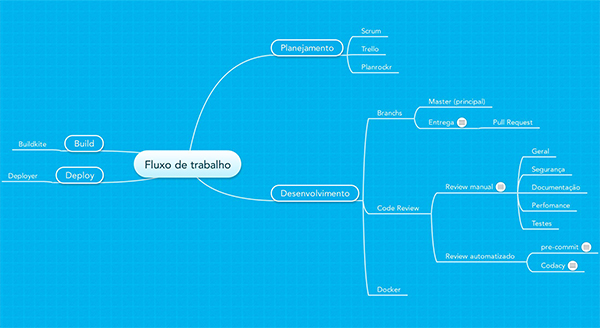

    

 

Modelo do fluxo de trabalho utilizado na empresa. Separado em 4 áreas bem definidas, o modelo tem como principal foco a padronização e agilidade nos processos internos, qualidade do código e entregas rápidas. Não deixe de conferir a [Wiki](https://github.com/angulo-digital/fluxo-trabalho/wiki) do projeto.

[Sugestões](https://github.com/angulo-digital/fluxo-trabalho/issues) são bem vindas :heart:

##Planejamento
- Scrum `metodologia ágil`
- [Trello](/planejamento/trello.md) `controle de tarefas`
- Planrockr `gerenciamento dos projetos`

##Desenvolvimento
- [Git Flow](/desenvolvimento/git-flow.md) `fluxo do versionamento`
- Docker `controle do ambiente local`
- Code Review `controle de qualidade do código`

##Build
- Buildkite `ferramenta para controle dos testes`

##Deploy
- Deployer `ferramenta para controle do deploy`